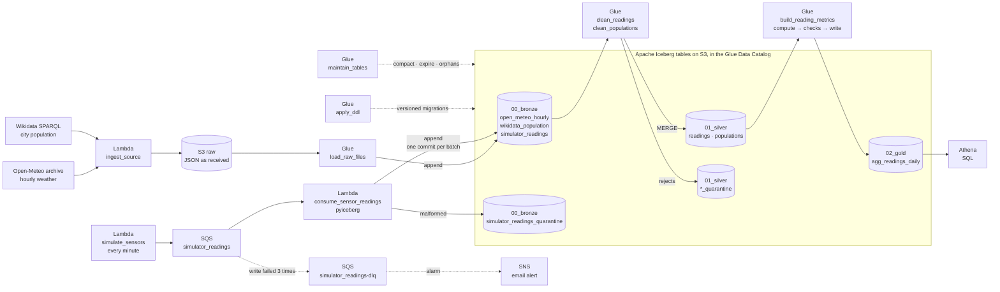
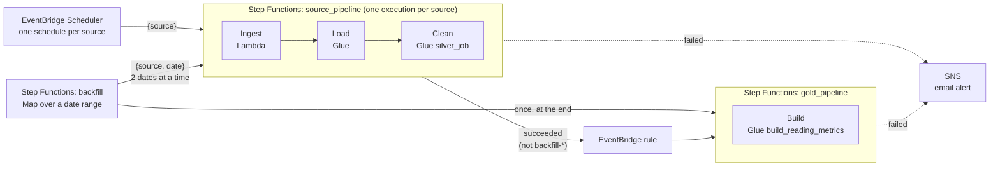

# AWS Glue + Iceberg medallion lakehouse

A medallion lakehouse (bronze → silver → gold) on AWS, built with **Apache Iceberg**, **AWS Glue** (PySpark), **Athena**, **Step Functions** and **Terraform**, using hourly weather-station telemetry.

It's the AWS counterpart of [databricks-pyspark-delta-medallion](https://github.com/matiastulli/databricks-pyspark-delta-medallion). The build is done one step at a time; [`docs/PLAN.md`](docs/PLAN.md) tracks the steps and what each one taught.

## Architecture

**Data flow.** Each source's API response lands untouched in S3, then moves through Iceberg tables layer by layer. Simulated live sensors take a second path into bronze: an SQS queue and a Lambda that appends with pyiceberg, without Spark. Silver is written with an idempotent `MERGE` on each entity's key, and invalid rows go to a quarantine table with the rules they broke. Gold is published only after its data quality checks pass. Tables are created and changed only by versioned migrations (`apply_ddl`), never by the jobs that write to them.



**Orchestration.** One generic state machine runs once per source, so a failing source never blocks another. Gold rebuilds itself whenever any source succeeds, and any failure sends an email. A backfill runs that same state machine once per date, then gold once.



## Local setup

Python 3.11 and Java 17. Versions match AWS Glue 5.1 (Spark 3.5.6, Iceberg 1.10.0).

```sh
python3.11 -m venv .venv && .venv/bin/pip install -r requirements.txt
export JAVA_HOME=$(/usr/libexec/java_home -v 17)
.venv/bin/python scripts/local_iceberg_smoke.py
```

The smoke test creates an Iceberg table partitioned by `days(observed_at)` in `./local-warehouse`, upserts into it with `MERGE INTO`, and reads the first snapshot back with time travel.

## Infrastructure

Terraform in [`terraform/`](terraform/), region `us-east-2`:

- [`terraform/bootstrap/`](terraform/bootstrap/): the S3 bucket for Terraform state and a monthly cost budget with email alerts. Applied once, with local state.
- [`terraform/`](terraform/): S3 buckets `raw` (landing JSON), `lake` (Iceberg warehouse), `athena-results` and `artifacts` (deployed code); Glue Data Catalog databases `00_bronze`, `01_silver`, `02_gold` (numbered so they sort in pipeline order) and `ops`; and an Athena workgroup that enforces the result location and a per-query bytes-scanned limit.

```sh
cp terraform/bootstrap/terraform.tfvars.example terraform/bootstrap/terraform.tfvars   # set alert_email (budget)
cp terraform/terraform.tfvars.example terraform/terraform.tfvars                       # set alert_email (pipeline alerts)
terraform -chdir=terraform/bootstrap init && terraform -chdir=terraform/bootstrap apply
terraform -chdir=terraform/bootstrap output -raw backend_hcl > terraform/backend.hcl
terraform -chdir=terraform init -backend-config=backend.hcl && terraform -chdir=terraform apply
```

## Pipeline

Two sources, each run as its own execution of one generic state machine:

| Source (bronze table) | API | Silver | Schedule |
|---|---|---|---|
| `open_meteo_hourly` | [Open-Meteo archive](https://open-meteo.com/en/docs/historical-weather-api): hourly temperature, humidity, precipitation, wind | `readings` (one row per station-hour) | daily |
| `wikidata_population` | [Wikidata SPARQL](https://query.wikidata.org/): each city's population counts with their dates | `populations` (one row per station and count date) | monthly |

Each `source_pipeline` execution takes `{"source": "<bronze table>", "date": "YYYY-MM-DD"}` (the date is optional) and runs three steps:

1. **Ingest** (Lambda `ingest_source`): calls the source's API for every station and writes each response to `s3://<raw>/<system>/<table>/date=YYYY-MM-DD/<station_id>.json`.
2. **Load** (Glue `load_raw_files`): appends that day's files to `"00_bronze".<source>`, read with the table's own schema (no inference) and tagged with `_batch_id` (the execution name), `_ingested_at` and `_source_file`.
3. **Clean** (the source's `silver_job` in config): flattens, validates and deduplicates the batch, then `MERGE`s it into `"01_silver".<entity>`, with rejects in `"01_silver".<entity>_quarantine`. A rerun of the same batch writes nothing.

When it succeeds, an EventBridge rule starts `gold_pipeline`, which rebuilds `"02_gold".agg_readings_daily` in the order compute → data quality checks → write. It writes only if every check passes and something changed. Schedules (EventBridge Scheduler, one per source) are deployed disabled; failures go to the SNS topic `weather-lakehouse-alerts`.

**Live readings:** `simulate_sensors` (Lambda, every minute through EventBridge Scheduler, deployed disabled) sends one reading per station to the SQS queue `simulator_readings`, and on purpose resends some and sends some late, at the rates in `[[streams]]` in the config. The SQS event source mapping calls `consume_sensor_readings` with up to 100 messages or 20 seconds of them, at most 2 at a time. It appends each batch to `"00_bronze".simulator_readings` with pyiceberg, one Iceberg commit per batch, and malformed messages (not JSON, an unknown field, a wrong type) to `simulator_readings_quarantine` with their raw body. A failed write sends just its messages back to the queue; after 3 receives they go to the dead-letter queue, which has an alarm. The pyiceberg layer is built with `scripts/build_pyiceberg_layer.sh`; pyarrow comes from the public AWS SDK for pandas layer.

**Backfill:** the `backfill` state machine takes `{"source": …, "start_date": …, "end_date": …}` (inclusive, at most 31 days) and starts one `source_pipeline` execution per date, two at a time, so every date is its own batch that fails and alerts on its own. It then runs `gold_pipeline` once; its per-date executions are named `backfill-<date>-…`, which the EventBridge rule skips. A rerun is safe: silver's `MERGE` reports 0 new and 0 changed rows.

`"02_gold".agg_readings_daily` has one row per station and day: temperature min/max/avg, a 7-day rolling average and the change vs the previous day, humidity, rain, max wind, and the city's population as of that day (the latest Wikidata count on or before it).

- Sources and stations are configured in [`config/sources.toml`](config/sources.toml). Table names, raw paths, API requests, the silver job and the default run date are derived from it. A failing source never blocks another.
- Code is grouped by entity: `src/<NN_layer>/<entity>/` holds the entity's migrations (`ddl_<table>_v<NNN>_<verb>.sql`) and the job that writes it (`glue_job_<process>.py`); processes that serve every source are in `src/00_bronze/_ingestion/`.
- Tables are created and changed only by those migrations, applied by the `apply_ddl` Glue job and recorded in `ops.schema_migrations`. Jobs check that their output matches the table exactly before writing.
- The `maintain_tables` Glue job keeps every Iceberg table healthy: it compacts small files (`sort` on sorted tables), rewrites manifests, expires snapshots older than 7 days (keeping the last 5) and removes orphan files older than 3 days, printing files, bytes and snapshots before and after. A weekly schedule is deployed disabled.
- Pure logic lives in [`src/medallion/`](src/medallion/) and is tested with `pytest` on local PySpark. [CI](.github/workflows/ci.yml) runs the tests and `terraform fmt` / `validate`; deploys are `terraform apply` from a laptop.

```sh
export JAVA_HOME=$(/usr/libexec/java_home -v 17) && .venv/bin/pytest
terraform -chdir=terraform plan -out=tfplan && terraform -chdir=terraform apply tfplan
aws glue start-job-run --job-name apply_ddl
aws stepfunctions start-execution --state-machine-arn <source_pipeline ARN> --name open_meteo_hourly-2026-09-20-a --input '{"source":"open_meteo_hourly","date":"2026-09-20"}'
aws stepfunctions start-execution --state-machine-arn <source_pipeline ARN> --name wikidata_population-2026-09-27-a --input '{"source":"wikidata_population"}'
aws stepfunctions start-execution --state-machine-arn <backfill ARN> --name open_meteo_hourly-2026-09-15-2026-09-19-a --input '{"source":"open_meteo_hourly","start_date":"2026-09-15","end_date":"2026-09-19"}'
```

Query in Athena (workgroup `weather-lakehouse`). The numbered databases need double quotes in queries:

```sql
SELECT station_id, cardinality(hourly.time) AS hours FROM "00_bronze".open_meteo_hourly;
SELECT station_id, observed_at, temperature_c FROM "01_silver".readings ORDER BY observed_at DESC LIMIT 10;
SELECT * FROM "01_silver"."readings$snapshots";   -- Iceberg metadata table: one snapshot per commit
SELECT station_id, reference_date, population FROM "01_silver".populations ORDER BY 1, 2;
SELECT station_id, reading_date, temperature_avg_c, precipitation_total_mm, population FROM "02_gold".agg_readings_daily ORDER BY 1, 2;
```
